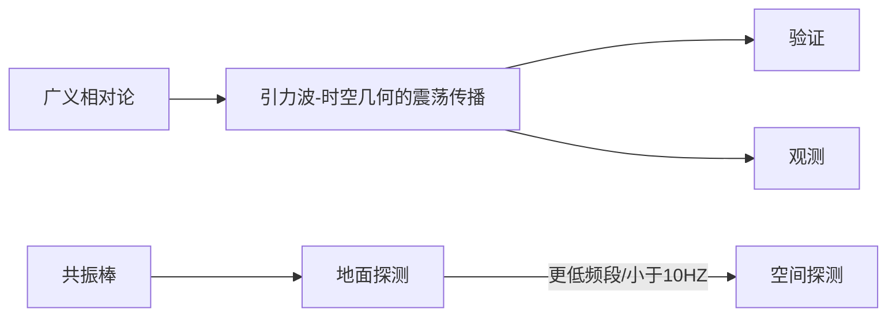
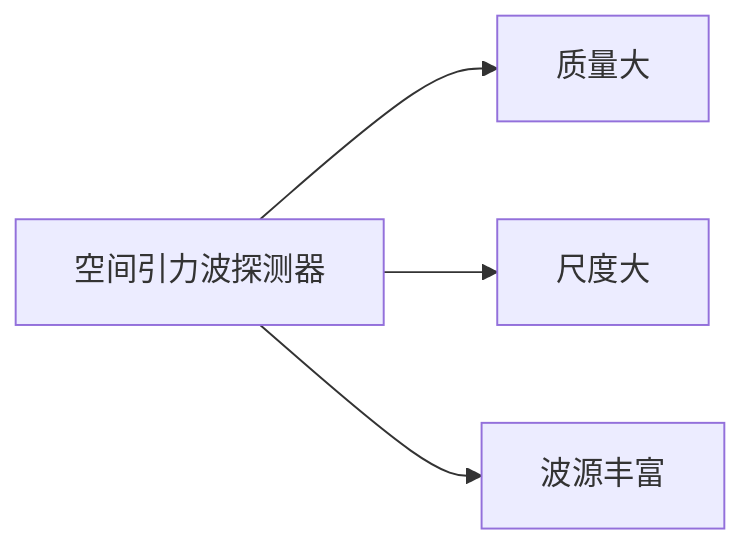

@[toc](目录)

# 空间激光干涉引力波探测
## 1. 引言 

## 2. 引力波的数学描述
- 度规张量：描述时空最基本的物理量，它包含了时空所有的几何结构与因果性信息。
- 当引力波经过时，时空度规张量发生变化，导致光子或其他物质粒子传播状态发生改变；另外，度规张量变化会引起时空曲率 (黎曼张量) 的变化，从而改变时空中两点间潮汐力的大小。
- 空间引力波探测利用**自由悬浮的测试质量**作为传感器
---
- 引力波对光在两测试质量间传播的影响

> 

大致距离改变量为10pm量级

- 引力波对加速度梯度的影响
> 

通过探测**两个测试质量上力的微小差别**来实现高精度的引力梯度测量

## 3. 空间引力波探测现状

- LISA
发射 3 颗相同的卫星，组成边长为5×10^6^km 的等边三角形， 在地球同步轨道上围绕太阳运转，探测频段为1mHz∼1Hz;
航天器间组成 3 个非独立的夹角为 60^°^的迈克尔逊干涉仪，用来测量航天器间的由引力波引起的距离变化。
每颗卫星上同时装载了两个测试质量，做为 3个迈克尔逊干涉仪的端点以及无拖曳航天所需的惯性传感器。

> 

> 
--- 

- 空间干涉仪灵敏度的噪声由位置噪声和加
速度噪声决定
**位置噪声**中的主要贡献者为激光散粒噪声 (shot noise)，单臂上的激光散粒噪声是白噪声。

